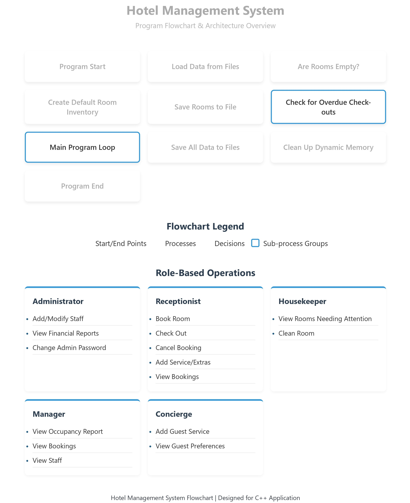
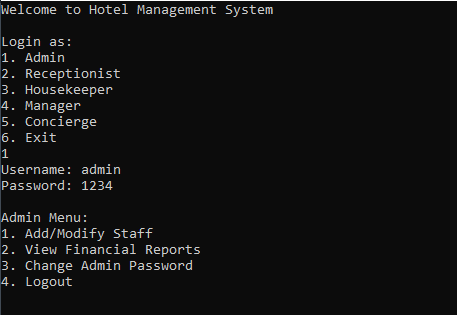
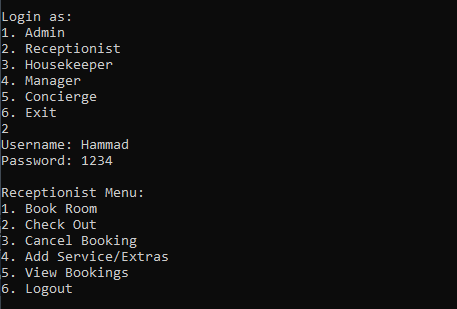
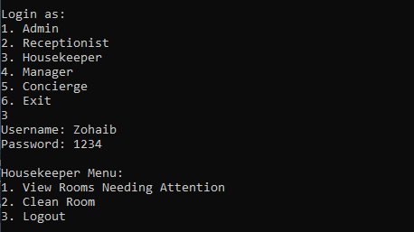
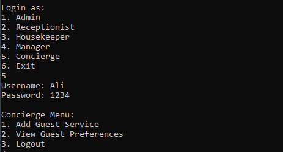

only single file like this:
# 🏨 Hotel Management System in C++ (OOP & File Handling)

This is a **complete Hotel Management System Project in C++** using **Object-Oriented Programming** and **File Handling**.  
It is a **comprehensive console application**, perfect for **developers and students** who want to master **C++ OOP concepts, file handling, and real-world application development**.

---

## 🚀 Features
- 👨‍💼 **Admin Module** (Secure Login, Manage Rooms & Staff)
- 👨‍💼 **Staff Module** (Check-in/Check-out, Generate Bills)
- 👤 **Guest Module** (Room Booking, View Status)
- 🏨 **Room Management** (Add/View/Update Rooms)
- 💰 **Billing & Invoice System**
- 📂 **Automatic Data Storage** (File Handling)
- 🔐 **Password Protection & Security**

---

## 🛠 Technologies Used
- C++ (Object-Oriented Programming)
- File Handling (`fstream`, `ifstream`, `ofstream`)
- OOP Concepts (Classes, Objects, Inheritance, Polymorphism)
- Data Structures & Algorithms
- Console UI Design

---

## 📊 Project Architecture

---

## 🖼 Output Screenshots

### Admin Menu  

### Manager Menu  

### Recetionist Menu 

### Housekeeping Menu   

### Concierge Menu   

---

## 🎥 Demo Video
[▶ Watch Full Demo Video](assets/videos/demo.mp4)  

---

## 🤝 Contributing
We welcome contributions! Feel free to:
- ⭐ Star this repository
- 🐛 Report bugs and issues
- 💡 Suggest new features
- 🔧 Submit pull requests

---

## 📄 License
This project is open source and available under the [MIT License](LICENSE).

---

## ✨ Author
👨‍💻 **Developed by Hammad Solutions**  

**⭐ If you find this project helpful, please give it a star on GitHub!**  
**🔔 Follow me for more amazing projects and tutorials!**

---

### 🔥 Why This Project Stands Out:
- ✅ **Real-world Application** of OOP concepts
- ✅ **Complete File Handling** implementation
- ✅ **Professional Console UI/UX**
- ✅ **Comprehensive Documentation**
- ✅ **Beginner to Advanced Level Learning**
- ✅ **Ready-to-Use** in educational institutions

**#CPlusPlus #OOP #FileHandling #HotelManagement #Programming #SoftwareDevelopment #Coding #Developer #CppProgramming #OpenSource #StudentProject #CodeNewbie**

---

*📞 Contact for collaboration and project development opportunities!*
